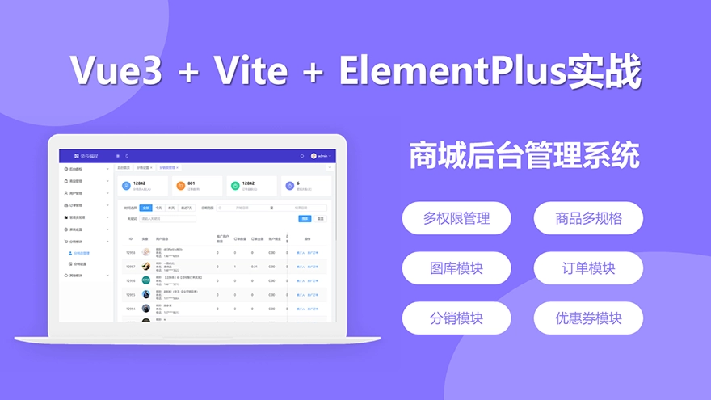
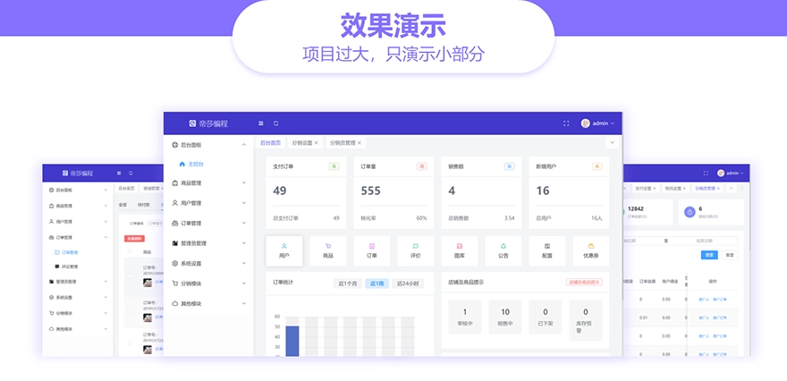
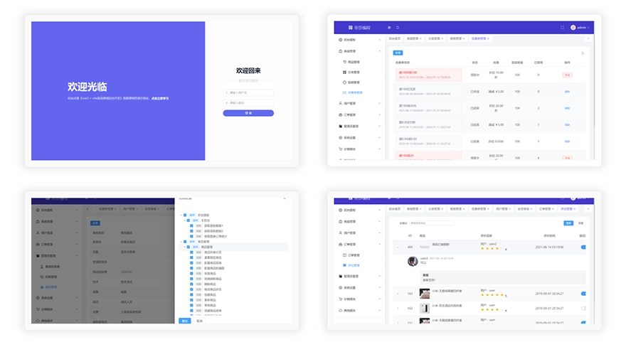
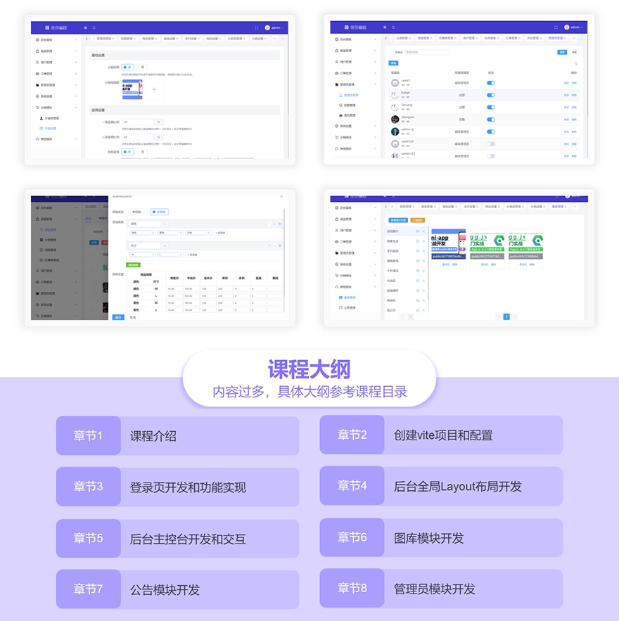
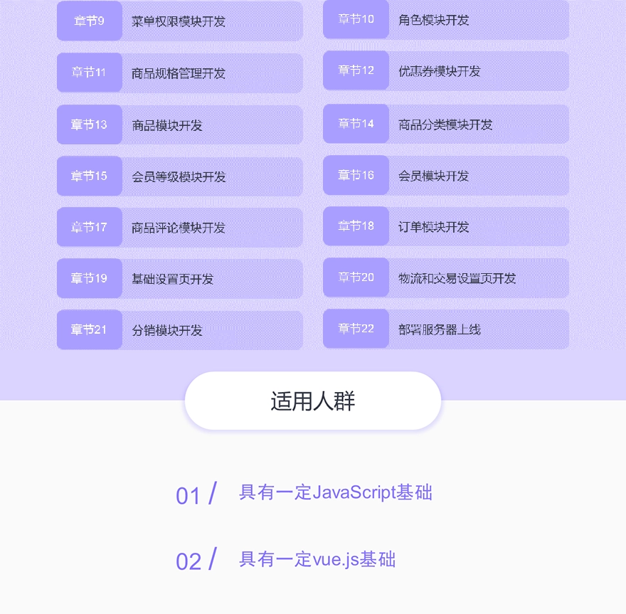

# [Vue3+Vite实战商城后台交流](https://study.163.com/course/introduction.htm?courseId=1212775807&_trace_c_p_k2_=189b67f8216d4067bf762ba00b82cdb0)

 

## 课程链接

👉 [网易云课堂 - Vue3+Vite实战商城后台交流](https://study.163.com/course/introduction.htm?courseId=1212775807&_trace_c_p_k2_=189b67f8216d4067bf762ba00b82cdb0)

 

## 适用人群
具有 `Html+Css+JavaScript` 基础，有一定的 `Vue.js` 基础，挑战高薪职位

 
 

## 课程概述
本季度预计 `150` 课时（如果有新内容，会继续增加），每周六更新（后期加速），每次更新 `10-20` 课时.

本季度基于 `Vue3 + ElementPlus + Vite` 实战开发商城后台管理系统，其中包括 `Vite` 的使用，`Vue3` 全新的 `<script setup>` 语法，`vuex4`、`Vue-router4`、使用`ElementPlus` 库、多权限管理、商品多规格实现、订单发货、导出订单、图库模块、分销模块、分享海报以及部署服务器上线知识等。

###【课程演示】
课程演示地址：`http://shopadmin.dishawang.com`
账号：`admin`  密码：`admin`

###【常见问题】

问题1：老师，这门课有涉及 Typescript 吗？
回答：靓仔，这门课没有加ts哦，主要是考虑到小白，打算下一门vue3的实战新课再加入

问题2：老师，这门课有讲后端开发吗？
回答：靓仔，只讲前端和前后端交互，不过会提供线上api接口和接口文档，另外 后端api源码 等课程完结之后也会共享到群文件中，同时也会提供后端api接口源码的部署教程。

问题3：在哪里下载课程呢？有交流群吗？
回答：为了方便下载课件和交流，创立了一个群：`530105610`，靓仔靓女们自己申请进入哦~

